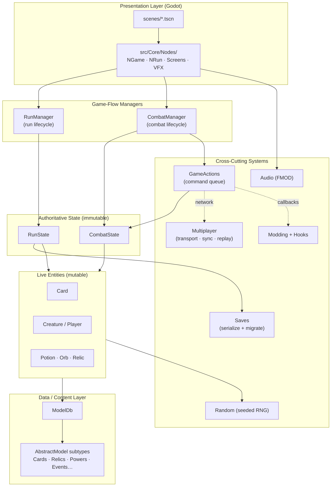
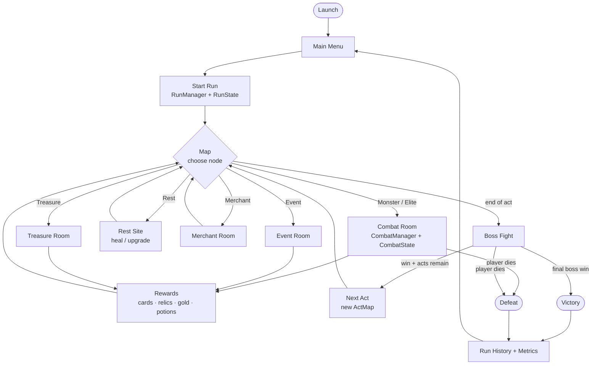

# Slay the Spire 2 — Architecture Reference

> A deep-reference guide to the structure of this project: what the major
> systems are, what they do, and where to find them.

---

## 1. Overview

**Slay the Spire 2** is a single- and multi-player roguelike deck-building game.
This repository contains a **decompiled** build of the game running on
**Godot 4.6** with game logic written in **C# (.NET 9)**. Godot provides the
scene graph, rendering, windowing and input; nearly all gameplay rules,
content definitions, networking and save logic live in the C# assembly
(`sts2`).

> ⚠️ **Note on decompiled source.** Because the code was reverse-engineered from
> a shipped build, you will see compiler-generated artifacts at the repo root
> (e.g. `--y__InlineArray*.cs`, `--z__ReadOnly*.cs`), `.uid` sidecar files next
> to most assets, and a `.autoconverted/` folder of converted GDScript. These
> are not hand-written and can largely be ignored when reading gameplay code.
> Identifier names in `src/` are mostly intact and meaningful.

The mental model is a layered one: **Godot nodes** render and capture input →
**managers** (`RunManager`, `CombatManager`) drive game flow → **state objects**
(`RunState`, `CombatState`) hold the truth of a run/fight → **entities**
(`Card`, `Creature`, `Player`) are the live, mutable pieces → **models**
(`ModelDb` / `AbstractModel`) are the immutable data definitions of all content.

---

## 2. Technology Stack

| Area | Choice | Notes |
|------|--------|-------|
| Engine | **Godot 4.6** | Godot SDK `4.5.1`; renderer **D3D12** on Windows; 2D/3D physics set to "Dummy" (UI-driven game) |
| Language / Runtime | **C# 13 / .NET 9** | Assembly name `sts2`; `Nullable` + `AllowUnsafeBlocks` enabled — see [sts2.csproj](sts2.csproj) |
| SDK pin | `.NET SDK 9.0.303` | `rollForward: latestMajor` — see [global.json](global.json) |
| Main scene | `res://scenes/game.tscn` | Defined in [project.godot](project.godot) |
| Autoloads (singletons) | `SentryInit`, `FmodManager` | Crash reporting + audio, registered in [project.godot](project.godot) |
| Audio | **FMOD** (GDExtension 6.1.0) | Banks under `banks/desktop/` |
| Networking | **Steamworks.NET** + **ENet** | Steam P2P transport with ENet fallback |
| Runtime patching | **0Harmony** (HarmonyLib) | Used by the modding layer |
| Key NuGet deps | Sentry, SmartFormat, Vortice.DXGI, MonoMod.Backports, JetBrains.Annotations, System.IO.Hashing | See [packages.lock.json](packages.lock.json) |

Referenced native/managed assemblies live in `_mono_referenced_assemblies/`
(`Steamworks.NET.dll`, `0Harmony.dll`).

---

## 3. Top-Level Directory Map

| Path | Role |
|------|------|
| [src/](src) | All C# source. `Core/` is the game; `GameInfo/`, `SourceGeneration/`, `gdscript/` are support. |
| [scenes/](scenes) | Godot `.tscn` scenes — UI, screens, rooms, VFX, backgrounds. Entry scene is `scenes/game.tscn`. |
| [shaders/](shaders) | `.gdshader` files — blur, afflictions, card effects, boss highlights, distortions (~46). |
| [animations/](animations) | Spine skeletal animations & spritesheets (`.skel` + `.atlas` + `.png`) per character/background. |
| [materials/](materials) | Godot `.tres` materials — card banners/frames, outlines, blur masks. |
| [models/](models) | 3D GLTF assets (minimal — e.g. a power-up mesh). |
| [images/](images) | Sprite/texture atlases — cards, monsters, relics, potions, orbs, UI, map, characters. |
| [fonts/](fonts) | Fonts incl. CJK/localized variants (Kreon, Spectral, Noto Sans CJK, …). |
| [themes/](themes) | Godot theme resources wrapping fonts & UI styling. |
| [localization/](localization) | Per-language text data (15 languages) + `completion.json`. |
| [banks/](banks) | FMOD audio banks (`Master`, `sfx`, `ambience`, per-act music) under `banks/desktop/`. |
| [steam/](steam) | Steamworks.NET platform binaries (Windows / OSX-Linux). |
| [addons/](addons) | Godot editor/runtime plugins (see below). |
| `.autoconverted/` | Auto-converted GDScript (`.gdc`) from the decompile — not primary source. |
| `.godot/` | Godot editor cache/import metadata — generated. |
| `System/`, `_mono_referenced_assemblies/` | Decompiled BCL stubs and referenced assemblies. |
| `RiderTestRunner/` | JetBrains Rider test-runner scaffolding. |

### Addons

| Addon | Purpose |
|-------|---------|
| `fmod` | FMOD audio engine integration (GDExtension). |
| `sentry` | Crash/error reporting (`SentryInit` autoload). |
| `atlas_generator` | Editor tool to build sprite atlases. |
| `dev_tools` | In-editor development/debug utilities. |
| `mega_text` | Rich text rendering/typography. |
| `megacontentcreator` | Content-authoring framework/tooling. |
| `spine` | Spine skeletal-animation runtime. |

---

## 4. High-Level Architecture

---

## 5. Core Subsystems

Everything below lives under [src/Core/](src/Core) unless otherwise noted.

### 5.1 Models / Data Layer — `src/Core/Models/`

The content database. All game definitions — cards, relics, powers, potions,
enemies, events, acts, and so on — are subclasses of
[AbstractModel.cs](src/Core/Models/AbstractModel.cs) and registered in the
static registry [ModelDb.cs](src/Core/Models/ModelDb.cs). Each model carries a
unique `ModelId` (`src/Core/Models/ModelId.cs`) made of a category + entry key.
Models are effectively **immutable data**: instances expose `AssertMutable()`
guards so they cannot be edited at runtime except during controlled
construction/modding.

Discovery is **reflection-driven**: types are marked with a `[GenerateSubtypes]`
attribute so the build can enumerate and register every concrete model without
a hand-maintained list — this is what makes the content layer extensible by
mods. Content is organized into per-type folders: `Cards/`, `Relics/`,
`Powers/`, `Potions/`, `Encounters/`, `Events/`, `Afflictions/`, `Acts/`,
`Monsters/`, `CardPools/` · `RelicPools/` · `PotionPools/`, `Modifiers/`
(ascension), `Achievements/`, `Badges/`, and `Characters/`.

### 5.2 Entities — `src/Core/Entities/`

The **live, mutable** counterparts to models. Where a `CardModel` defines what a
card *is*, a `Card` is a specific instance in a deck with current cost, upgrades,
and temporary modifiers. Subfolders:

- `Cards/` — `Card`, `PileType` (hand/draw/discard/exhaust), `TargetType`,
  `CostModifiers`, `TemporaryCardCost`, `OrbEvokeType`, `UnplayableReason`.
- `Players/` — `Player`, `PlayerCombatState`, `ExtraPlayerFields`.
- `Creatures/` — `Creature` (base for players + monsters), `DamageResult`, `SummonResult`.
- `Potions/`, `Orbs/` (Defect-style orb queue), `Enchantments/` (card enchant options).

### 5.3 Combat — `src/Core/Combat/`

Owns a single fight. [CombatManager.cs](src/Core/Combat/CombatManager.cs) is the
combat singleton: it drives turn order, executes the action queue, and detects
victory/defeat. [CombatState.cs](src/Core/Combat/CombatState.cs) is the immutable
snapshot of the fight (allies, enemies, round number, current `CombatSide`) and
implements `ICardScope`. The `History/` submodule records timestamped entries
(card drawn, damage received, power applied, …) used for undo, analytics, and
replay.

### 5.4 Runs / Progression — `src/Core/Runs/`

Owns an entire run across all acts. [RunManager.cs](src/Core/Runs/RunManager.cs)
is the run singleton (transitions, music, achievements);
[RunState.cs](src/Core/Runs/RunState.cs) is the immutable run snapshot (acts,
current map coordinate, players, deck, visited rooms) and implements
`IRunState`/`ICardScope`/`IPlayerCollection`. Card-reward generation
(`CardCreationOptions`, `CardCreationSource`, `RelicGrabBag`), `GameMode`
(standard/daily/custom), the `History/` replay log, and `Metrics/`
(per-encounter and per-choice statistics) all live here.

### 5.5 Map — `src/Core/Map/`

Act-map generation and navigation. `ActMap` is the abstract base with concrete
strategies `StandardActMap`, `GoldenPathActMap`, `SpoilsActMap`. A map is a graph
of `MapPoint`s (each a `MapPointType` — monster/elite/treasure/event/rest/merchant
— with a `MapPointState`) addressed by `MapCoord`. `MapPathPruning` removes
unreachable paths after generation.

### 5.6 Rooms / Encounters — `src/Core/Rooms/`

A "room" is what you enter when you step on a map node. `AbstractRoom` is the
base; concrete types are `CombatRoom`, `TreasureRoom`, `MerchantRoom` (shop),
`EventRoom` (scripted events, may embed combat), `RestSiteRoom`
(heal/upgrade/smith), and `MapRoom` (the map-selection screen). `RoomType`
enumerates them.

### 5.7 Monster Moves / Enemy AI — `src/Core/MonsterMoves/`

How enemies decide and telegraph actions. The `Intents/` hierarchy
(`AbstractIntent` → `AttackIntent`, `MultiAttackIntent`, `BuffIntent`,
`DebuffIntent`, `DefendIntent`, `SummonIntent`, `EscapeIntent`, `HealIntent`,
typed by `IntentType`) is the player-visible "what the enemy will do next." A
**move state machine** (`MonsterMoveStateMachine`, `MoveState`,
`ConditionalBranchState`, `RandomBranchState`, with `MoveRepeatType`) sequences
those moves per enemy script.

### 5.8 Game Actions — `src/Core/GameActions/`

Turn flow as a **command queue**. Every discrete game step is a `GameAction`
subclass — `PlayCardAction`, `EndPlayerTurnAction`, `UsePotionAction`,
`PickRelicAction`, `MoveToMapCoordAction`, `UndoEndPlayerTurnAction`,
`ReadyToBeginEnemyTurnAction`, etc. An `ActionExecutor` runs the queue in order.
A `Multiplayer/` submodule wraps actions as `INetAction` for network transport
and handles player-choice resolution and queue synchronization across peers.

### 5.9 Rewards — `src/Core/Rewards/`

Post-room loot. `Reward` is the base; concrete types include `CardReward`,
`SpecialCardReward`, `CardRemovalReward`, `RelicReward`, `PotionReward`,
`GoldReward`. `RewardsSet` / `LinkedRewardSet` group multiple rewards shown
together; `RewardType` enumerates them.

### 5.10 Events — `src/Core/Events/`

Scripted narrative encounters. `EventOption` is a player choice and
`EventLayoutType` controls presentation. A `CustomEvents/` submodule holds
bespoke logic such as the Crystal Sphere minigame. Event *definitions* live in
`src/Core/Models/Events/`.

### 5.11 UI / Nodes — `src/Core/Nodes/`

The Godot-facing layer; classes here are `N*`-prefixed nodes that wrap scenes
in `scenes/`. Top-level entry nodes are [NGame.cs](src/Core/Nodes/NGame.cs)
(root game node) and [NRun.cs](src/Core/Nodes/NRun.cs) (the run container that
swaps between rooms), plus `NSceneContainer` and `NTransition`. Subfolders mirror
gameplay systems: `Screens/` (full-screen menus), `Combat/`, `Cards/`, `Relics/`,
`Potions/`, `Orbs/`, `CommonUi/`, `HoverTips/`, `TopBar/`, `Ftue/`
(first-time-user tutorial), `Animation/`, `Audio/`, and `Pooling/`
(object pooling). A large `Vfx/`-style set of effect nodes (card-fly, damage
numbers, etc.) handles combat juice.

### 5.12 Save / Load — `src/Core/Saves/`

Persistence. `SaveManager` orchestrates saving; `SerializableRun` is the
JSON-serializable run snapshot. There are separate `ProfileSave`, `SettingsSave`,
and `PrefsSave` types with matching managers, plus `CloudSaveStore` for cloud
sync and `GodotFileIo` as the I/O abstraction. A `Migrations/` submodule contains
a long chain of versioned upgraders (e.g. `SerializableRunV15ToV16`) so old saves
load into new builds, alongside custom JSON converters for models/cards/relics.

### 5.13 Multiplayer — `src/Core/Multiplayer/`

Full co-op networking. The game runs through a service abstraction —
`NetSingleplayerGameService`, `NetHostGameService`, `NetClientGameService`,
`NetReplayGameService` — so single-player, host, client, and replay all share one
code path. `Transport/` provides the wire (Steam P2P and ENet); `Serialization/`
has efficient binary `PacketWriter`/`PacketReader` plus `ModelIdSerializationCache`
to compress model IDs; `Messages/` defines lobby and in-game message types;
`NetMessageBus` routes them; `CombatStateSynchronizer` keeps fights in lock-step;
and `Replay/` records and plays back combats.

### 5.14 Modding & Hooks — `src/Core/Modding/` + `src/Core/Hooks/`

Extensibility without editing source. `ModManager` discovers and loads mods
(`Mod`, `ModManifest`, `ModSettings`); `ModHelper` is the public author-facing
API. The `Hooks/` system lets mods subscribe to gameplay events (e.g.
`ModifyDamageHookType`), with `GenericHookGameAction` firing callbacks inside the
action queue and `RunHookSubscriptionDelegate` / `CombatHookSubscriptionDelegate`
defining subscription points. Runtime patching is available via HarmonyLib
(`0Harmony`).

### 5.15 Random / RNG — `src/Core/Random/`

Deterministic, seeded randomness for reproducible runs and fair multiplayer.
`RunRngSet` holds per-category generators; `PlayerRngType` and `RunRngType`
categorize streams (card draw, map gen, rewards, …) so each consumer draws from
an isolated, seeded sequence.

### 5.16 Audio — `src/Core/Audio/`

Bridges gameplay to FMOD. `FmodSfx` triggers sound events; `DamageSfxType` and
similar enums map gameplay moments to banks. The `FmodManager` autoload (from the
`fmod` addon) owns the FMOD system and loads banks from `banks/desktop/`.

### 5.17 Supporting Systems

| Folder | Role |
|--------|------|
| `Achievements/` | Achievement tracking and unlock conditions. |
| `Timeline/` | Story/epoch progression (`Stories/`, `Epochs/`) — seasonal/narrative content. |
| `Unlocks/` | Content-unlock gating. |
| `Daily/` | Daily-challenge run generation. |
| `Leaderboard/` | Score/leaderboard submission. |
| `Settings/` | Game settings (aspect ratio, fast mode, …). |
| `Platform/` | Cross-platform abstraction (Steam / desktop). |
| `Localization/` | Runtime string lookup over `localization/` data. |
| `ControllerInput/` | Gamepad/controller mapping and navigation. |
| `CardSelection/` | Controller-driven card-targeting/selection logic. |
| `Logging/` | Debug + analytics logging. |
| `DevConsole/` | In-game developer console commands. |
| `Debug/` | Debug overlays and tooling. |
| `AutoSlay/` | Automated/AI play support (likely testing or auto-resolve). |
| `Odds/` | Probability/odds computation for rewards & generation. |
| `Factories/` | `CardFactory`, `RelicFactory`, `PotionFactory` — build entities from models. |
| `Commands/` | Builders for animation/VFX command sequences. |
| `Helpers/` · `Extensions/` | Utility methods and LINQ/Godot extension methods. |
| `RichTextTags/` · `TextEffects/` | Rich-text formatting and animated text. |
| `HoverTips/` | Tooltip/keyword popup logic. |
| `Context/` | Ambient `LocalContext` plumbing. |
| `Bindings/` | Spine/MegaSpine animation bindings. |
| `Exceptions/` | Custom exception types. |
| `Assets/` | Asset cache / preload helpers. |
| `TestSupport/` | Test fixtures and harness helpers. |

### 5.18 Non-`Core` Source

- [src/GameInfo/](src/GameInfo) — `CardInfo`, `RelicInfo`, `PotionInfo`,
  `EncounterInfo`, `EventInfo`, `Keywords` — a data-export layer (wikis/tools).
- [src/SourceGeneration/](src/SourceGeneration) — build-time code generation
  (e.g. the `[GenerateSubtypes]` machinery).
- [src/gdscript/](src/gdscript) — the C#↔GDScript interop surface.

---

## 6. Key Architectural Patterns

- **Data-driven content** — every game object is an `AbstractModel` registered in
  `ModelDb`, discovered by reflection via `[GenerateSubtypes]`. Adding content =
  adding a model.
- **Immutable state + mutable entities** — `RunState` / `CombatState` are
  immutable snapshots; `Card` / `Creature` / `Player` are mutated in place.
- **Command pattern** — all turn actions are `GameAction`s run by an
  `ActionExecutor`; this enables ordering, undo, and network serialization.
- **Hook/event modding** — mods inject behavior by subscribing to typed hooks
  rather than patching (Harmony available for deeper patches).
- **Factory pattern** — `*Factory` classes instantiate entities from models.
- **History / replay** — `CombatHistory` and `RunHistory` log timestamped
  entries; `Replay/` reconstructs fights.
- **Save migrations** — a versioned `Migrations/` chain keeps old saves loadable.
- **Network state synchronization** — one `Net*GameService` abstraction with
  compact binary packets and a combat synchronizer keeps peers deterministic.
- **Godot signal-based async** — UI awaits Godot signals via extension helpers.
- **Object pooling** — `Nodes/Pooling/` reuses heavy UI/VFX nodes.

---

## 7. Entry Points & Central Singletons

| Symbol | File | Role |
|--------|------|------|
| `scenes/game.tscn` | [scenes/game.tscn](scenes/game.tscn) | Godot main scene; boots the game. |
| `NGame` | [src/Core/Nodes/NGame.cs](src/Core/Nodes/NGame.cs) | Root game node. |
| `NRun` | [src/Core/Nodes/NRun.cs](src/Core/Nodes/NRun.cs) | Run container; swaps rooms/screens. |
| `RunManager.Instance` | [src/Core/Runs/RunManager.cs](src/Core/Runs/RunManager.cs) | Run lifecycle singleton. |
| `CombatManager.Instance` | [src/Core/Combat/CombatManager.cs](src/Core/Combat/CombatManager.cs) | Combat lifecycle singleton. |
| `RunState` | [src/Core/Runs/RunState.cs](src/Core/Runs/RunState.cs) | Immutable run truth. |
| `CombatState` | [src/Core/Combat/CombatState.cs](src/Core/Combat/CombatState.cs) | Immutable combat truth. |
| `ModelDb` | [src/Core/Models/ModelDb.cs](src/Core/Models/ModelDb.cs) | Static content registry. |
| `FmodManager` (autoload) | `addons/fmod/FmodManager.gd` | Audio system. |
| `SentryInit` (autoload) | `addons/sentry/SentryInit.gd` | Crash reporting. |

---

## 8. Gameplay Loop

---

*Generated as an onboarding reference. Paths point at the decompiled C# source
under [src/Core/](src/Core); diagrams render on GitHub and in any Mermaid-aware
Markdown viewer.*
